# 思源笔记 Mermaid 用法参考

## 概述

Mermaid 是一个基于 JavaScript 的图表绘制工具，可以通过简单的文本语法生成流程图、时序图、甘特图等多种图表。思源笔记原生支持 Mermaid 渲染。

## 在思源笔记中使用 Mermaid

### 创建 Mermaid 图表

在思源笔记中，使用代码块输入 Mermaid 语法：

**Markdown语法三连字** 方式：
````markdown
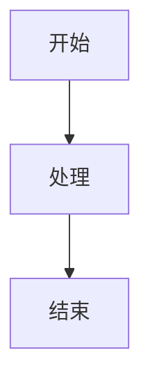
````

**官方文档推荐的三连字方式**（推荐）：
````markdown
~~~mermaid
graph TD
A[开始] --> B[处理]
B --> C[结束]
~~~
````

### 注意事项

- 使用 `~~~` 代替 ` ````
- 必须指定 `mermaid` 作为语言标识
- 图表会在编辑器中实时预览或点击预览时显示

## 支持的图表类型

### 1. 流程图 (Flowchart)

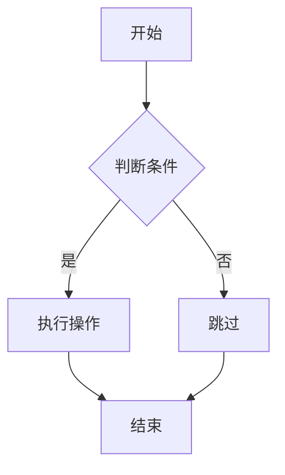

**流程图方向：**
- `TD` 或 `TB` - 从上到下 (Top-Down/Top-Bottom)
- `BT` - 从下到上 (Bottom-Top)
- `LR` - 从左到右 (Left-Right)
- `RL` - 从右到左 (Right-Left)

**节点形状：**

| 形状 | 语法 | 说明 |
|------|------|------|
| 圆角矩形 | `A[文本]` | 标准流程节点 |
| 矩形 | `B[文本]` | 通用节点 |
| 菱形 | `C{文本}` | 判断/决策节点 |
| 圆形 | `D((文本))` | 连接节点 |
| 文档 | `E[文本/]` | 文档节点 |
| 数据库 | `F[(文本)]` | 数据库节点 |

**节点间连接：**
- `-->` - 实线箭头
- `---` - 实线
- `-.->` - 虚线箭头
- `===` - 粗线

**添加标签：**
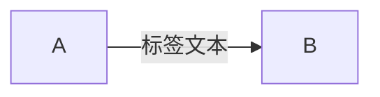

### 2. 时序图 (Sequence Diagram)

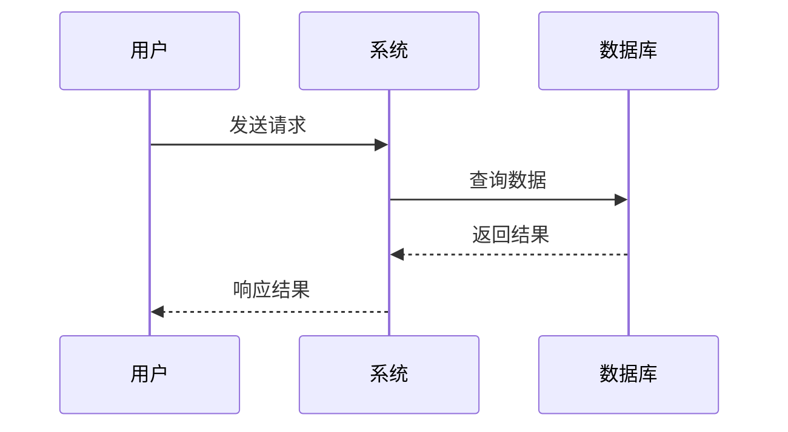

**时序图语法：**
- `->>` - 实线箭头（同步消息）
- `-->>` - 虚线箭头（异步消息/响应）
- `->` - 实线无箭头
- `-->` - 虚线无箭头
- `autonumber` - 自动编号（放在代码开头）

### 3. 类图 (Class Diagram)

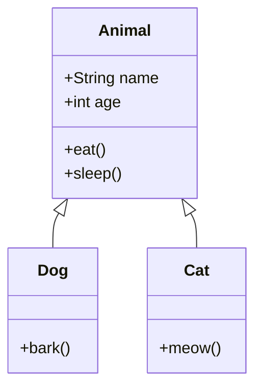

**类图关系：**
- `-->` - 关联
- `--|>` - 继承
- `..|>` - 实现
- `-->o` - 聚合
- `-->*` - 组合
- `..>` - 依赖

### 4. 状态图 (State Diagram)

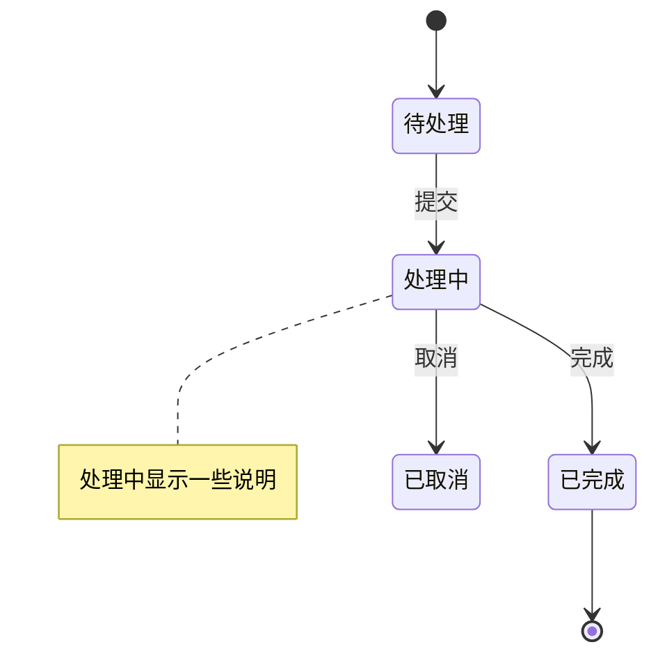

### 5. 甘特图 (Gantt Chart)

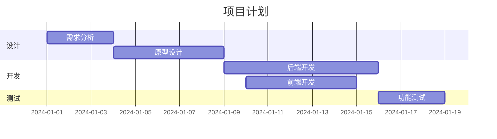

### 6. 饼图 (Pie Chart)

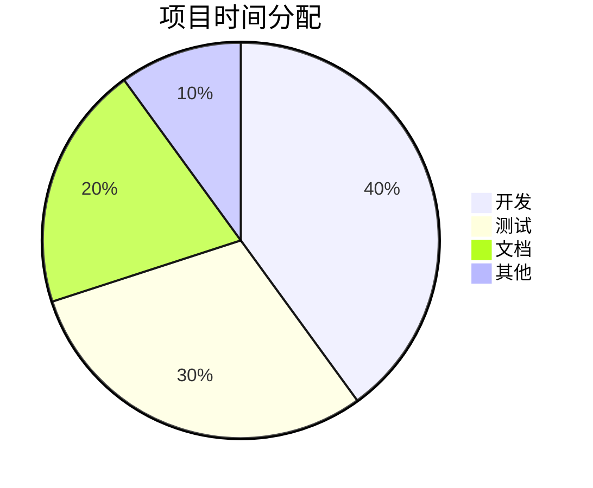

### 7. ER 图 (Entity Relationship)

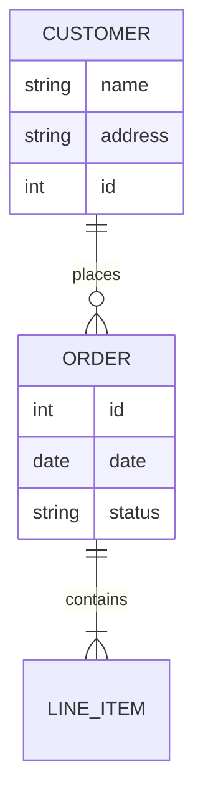

### 8. 导航图 (User Journey)

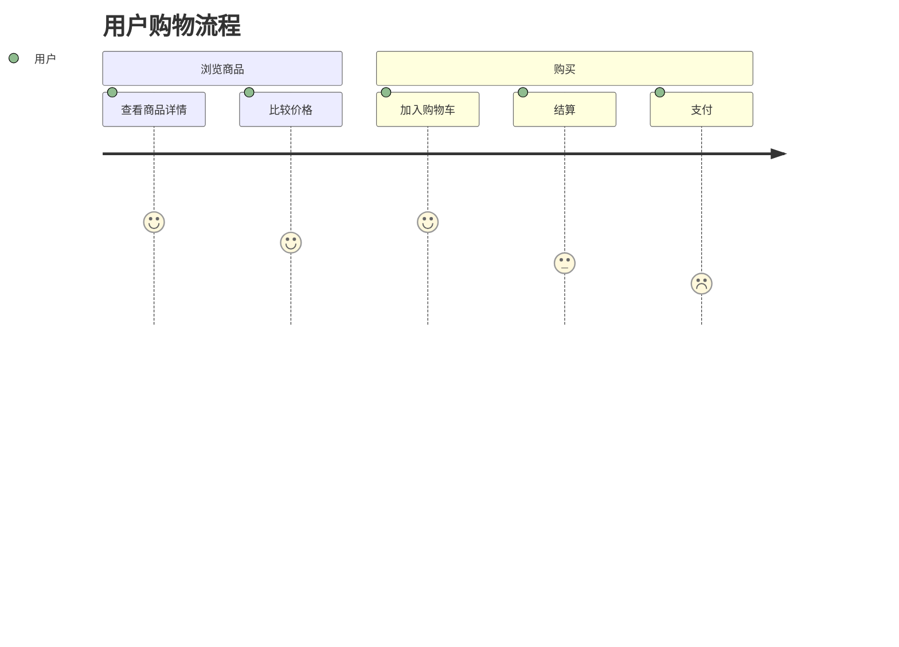

### 9. Git 图 (Git Graph)

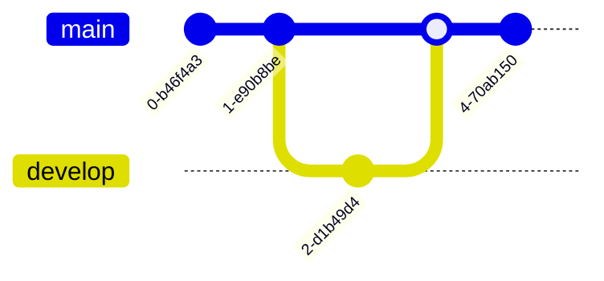

### 10. 思维导图 (Mindmap)

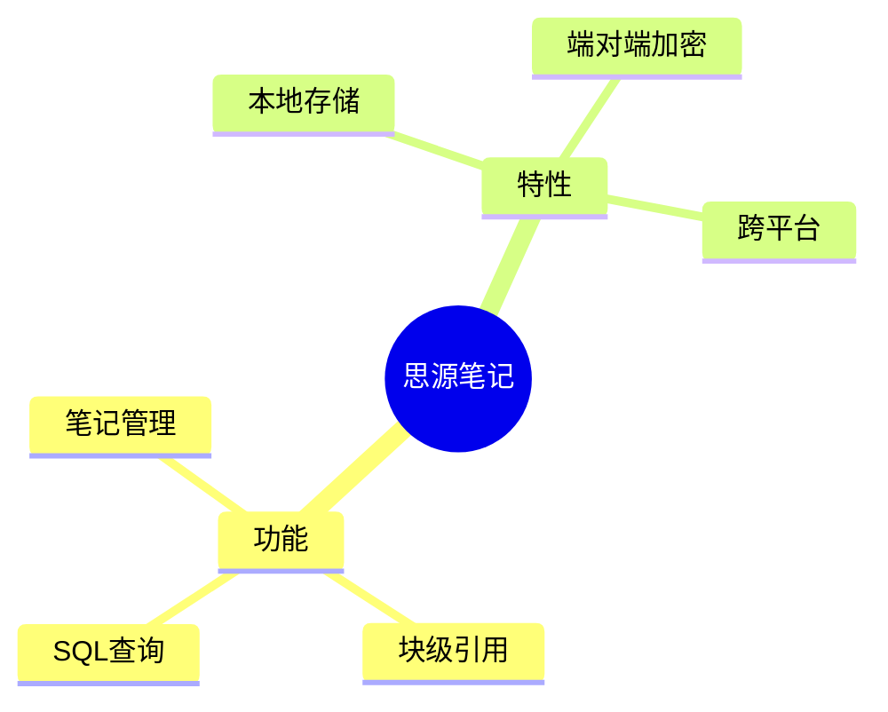

## 高级功能

### 子图 (Subgraphs)

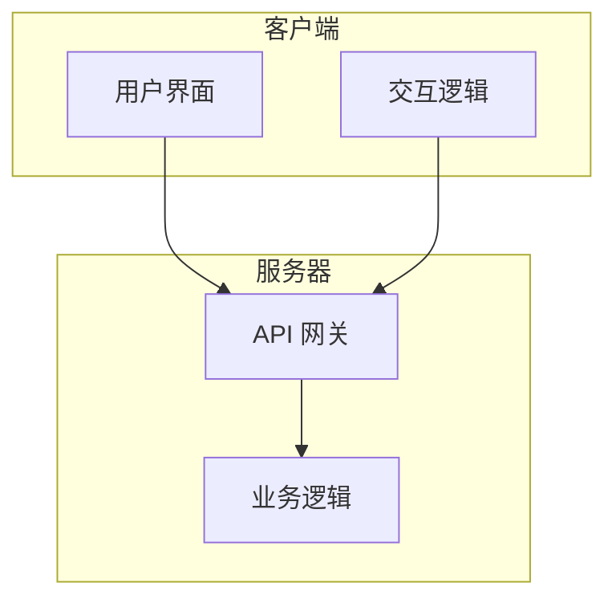

### 样式定制

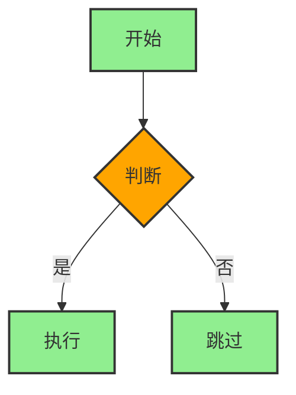

### 注释

在 Mermaid 中使用 `%%` 添加注释：


## 在思源笔记中的特殊设置

思源笔记支持通过特殊语法设置 Mermaid 配置：

````
~~~mermaid
%%{init: {'theme': 'base', 'themeVariables': {'primaryColor': '#ffcccc'}}}%%

graph TD
A[开始] --> B[结束]
~~~
```

**可用主题：**
- `default` - 默认主题
- `forest` - 森林主题
- `dark` - 暗色主题
- `neutral` - 中性主题
- `base` - 基础主题（可完全自定义）

## 常见问题

### 图表不显示

1. 检查是否使用 `~~~mermaid` 而非 ` ```mermaid`
2. 确认思源笔记版本支持该图表类型
3. 检查语法是否正确

### 图表渲染缓慢

- 复杂图表可能需要几秒钟渲染
- 建议减少节点数量和关系复杂度

### 支持的 Mermaid 版本

思源笔记定期升级 Mermaid 版本，支持最新的功能和特性。

## 参考资源

- [Mermaid.js 官方文档](https://mermaid.js.org/)
- [思源笔记官方文档](https://siyuan-note.cn/)
- 思源笔记关于页：https://siyuannote.com/article/1725501271

## 示例集合

### 完整项目流程图

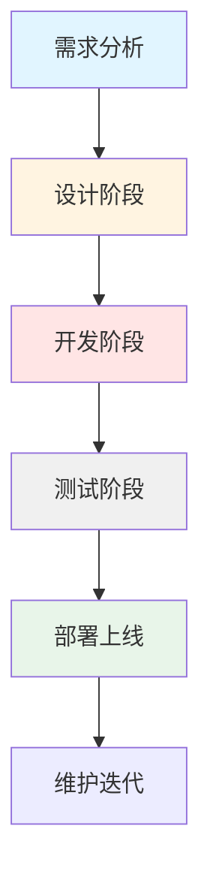

### 复杂时序图

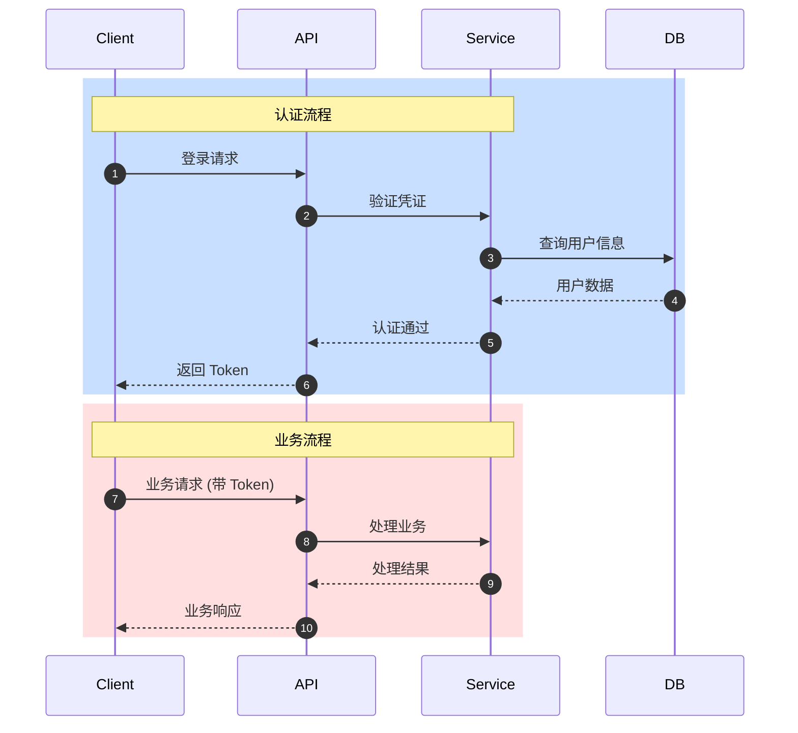

---

**最后更新：2024-01**

如需了解更多详细信息，请查阅 [Mermaid 官方文档](https://mermaid.js.org/)